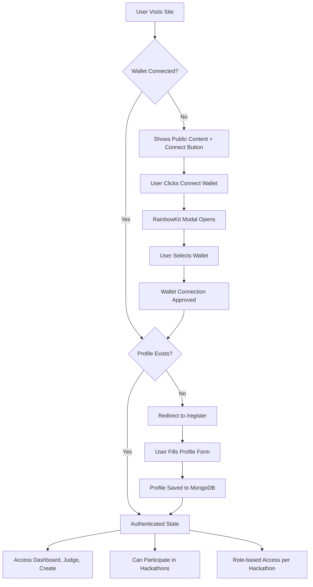

```mermaid
graph TD
    A[User Visits Site] --> B{Wallet Connected?}
    B -->|No| C[Shows Public Content + Connect Button]
    B -->|Yes| D{Profile Exists?}
    
    C --> E[User Clicks Connect Wallet]
    E --> F[RainbowKit Modal Opens]
    F --> G[User Selects Wallet]
    G --> H[Wallet Connection Approved]
    H --> D
    
    D -->|No| I[Redirect to /register]
    D -->|Yes| J[Authenticated State]
    
    I --> K[User Fills Profile Form]
    K --> L[Profile Saved to MongoDB]
    L --> J
    
    J --> M[Access Dashboard, Judge, Create]
    J --> N[Can Participate in Hackathons]
    J --> O[Role-based Access per Hackathon]
```
